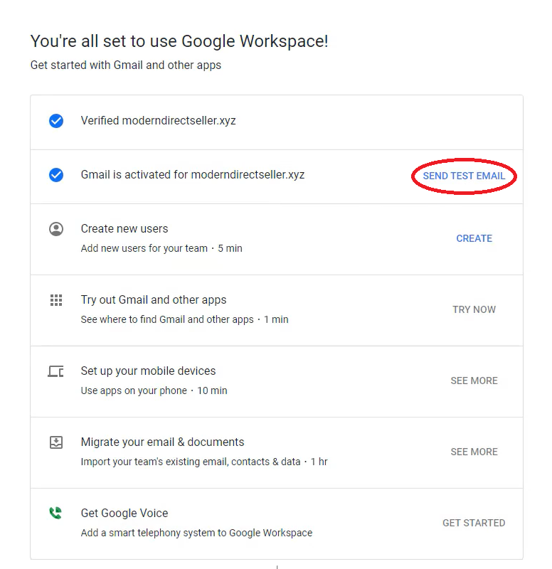
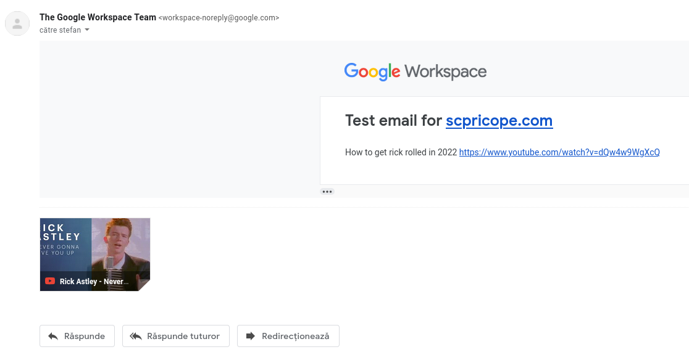
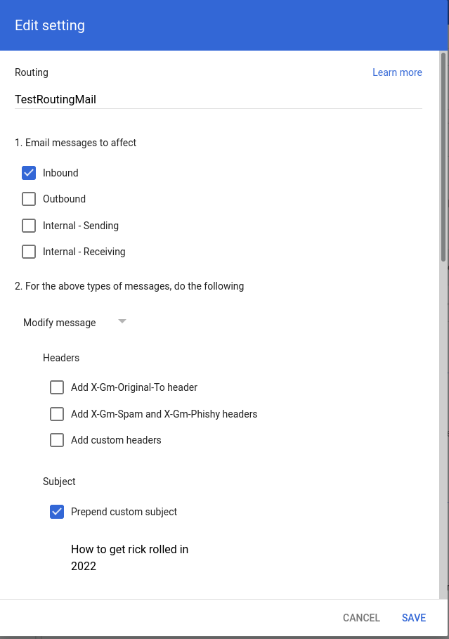
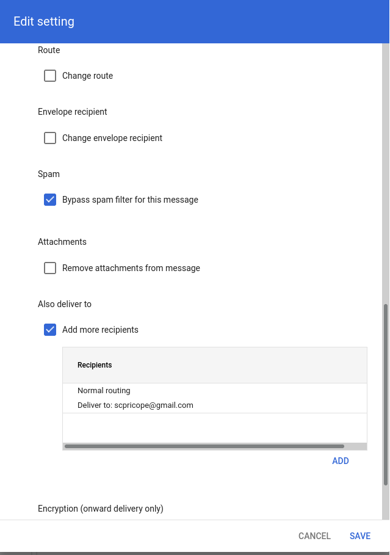


**This is my first ever bug-bounty writeup so please be kind. For any observations or recommendations please don't hesitate to leave a comment below or send me an email at [stefan@scpricope.com](mailto:stefan@scpricope.com)**



## Introduction <a name="introduction"></a>
This is a write-up regarding a bug in the Google Workspace dashboard where a malicious workspace administrator could exploit the Workspace API and email routing features in order to send emails with arbitrary subject and body from the `workspace-noreply@google.com` address. In order to exploit this vulnerability you need to have access to a Google Workspace domain where the domain ownership was verified and the MX records are pointing to Google servers, so that we can try to send a test email to check our configuration.

This is also my first bug write-up ever, really sorry for any mistakes! Please don't hesitate to leave some writing tips in the comments (or send them to scpricope@gmail.com).

At the beginning of March 2022 I wanted to try and get my own email address using my domain. Most results I found required paying for a subscription upfront, with the most noticeable exception being Google Workspaces which offered a free trial for up to 2 weeks in order to test out the platform.


## Setting up Google Workspace <a name="setup"></a>
For those of you who don't know, Google Workspace (previously known as Google Apps and G Suite) is the name of the Google product which basically bundles other Google products (such as GMail, Drive, Calendar, Meet, Docs etc.) under a more united enterprise solution that also offers additional features compared to their free version.

After setting up the Workspace (creating a DNS TXT record to prove that I own my domain, changing the MX records to point to the Google SMTP severs), I was redirected to https://admin.google.com/u/0/ac/signup/setup/v2/explore where I could ask Google to send me a test email in order to confirm that everything was configured and working properly. 

However, my brain also decided to wander a little bit too much in that moment.

<p align="center"><b>"Hmmm, could this be exploited?"</b></p>
<p align="right">- me (and a lot of other people)</p>

Since it was a pretty slow Sunday, I had more than enough time to take a quick look at a few web requests and their parameters, test a few variations, realise that nothing was exploitable (since we're talking about a giant like Google here), and go on about my day. 


I was expecting something like a GET/POST request to a /send_test_email endpoint just with the session cookies and without any parameters, and Google would send the email from their backend with a fixed message to the Workspace admin mailbox. So you can imagine my surprise when I opened the Developer Tools Network tab and discovered that the "Send test email" button was also sending the recipient email address and the message body to the web endpoint in the HTTP form data (data that I have complete control over).


## Testing and exploitation <a name="testing"></a>
Right after setting up your Google Workspace domain, you will see the following options:


  

*I forgot to take a screenshot of this, image from this setup guide:
https://moderndirectseller.com/custom-email-gsuite-godaddy/*

<br />

Opening up the developers tools and checking the network tab, we can see that clicking the "Send test email" button will send the following request (stripped down request data to only relevant info):
```http
POST /u/0/_/DasherSignupAdminConsoleUi/data/batchexecute?rpcids=B48Dsc&source-path=... HTTP/2
Host: admin.google.com
Cookie: session cookies, tracking cookies
Content-Type: application/x-www-form-urlencoded;charset=utf-8
...

f.req=%5B%5B%5B%22B48Dsc%22%2C%22%5B%5B%5C%22%2Fv2%5C%22%5D%2C3%2C%5B%5B%5C%2207518371650041255921%5C%22%2C%5B%5C%22stefan%40scpricope.com%5C%22%5D%2C%5C%22Hi%2C%20welcome%20to%20Google%20Workspace!%5C%22%5D%5D%2C%5C%22012kakut%5C%22%5D%22%2Cnull%2C%22generic%22%5D%5D%5D&at=AN0vbtkKy6ZRqjDfPFKSnqEVUkUR%3A1647163838894&
```

We can notice in the request data that my administrator email (stefan@scpricope.com) and the email message ("Hi, welcome to Google Workspace") are sent as part of f.req form parameter. Decoding the form parameters using the built-in BurpSuite decoder or other tools (like [CyberChef](https://gchq.github.io/CyberChef/)) will show a clearer picture as to how the parameters are sent to the endpoint:
```
f.req=[[["B48Dsc","[[\"/v2\"],3,[[\"07518371650041255921\",[\"stefan@scpricope.com\"],\"Hi, welcome to Google Workspace!\"]],\"012kakut\"]",null,"generic"]]]&at=AN0vbtkKy6ZRqjDfPFKSnqEVUkUR:1647163838894&
```

We can now clearly see that the parameters are sent as one big array (that contains other nested arrays) of values. Ryan Kovatch has done a great job in [this medium post explaining how the RPC batchexecute works](https://kovatch.medium.com/deciphering-google-batchexecute-74991e4e446c), I really recommend reading it for more information. For the moment though, I decided to focus on 2 parameters that were pretty clear what they were used for:

- "stefan@scpricope.com" was my Google Workspace administrator address (basically the root user of the whole domain) and the recipient of the test email.
- "Hi, welcome to Google Workspace!" was the email text body.

Changing the recipient to other email addresses didn't seem to work, my guess is that Google had a check in the backend that the recipient had a @scpricope.com email address. However, changing the message body worked fine and I could now send email with whatever text I wanted to my admin mailbox from an official @google.com address.



*Maybe I exaggerated a bit and I didn't have full control over the email body, Google also prepends a header in the backend to the body*

<br />

I thought about reporting this to Google, but quickly dismissed the idea since I could only send these modified emails only to my inbox. I needed to find a way to also change the recipient while still keeping the original sender (I could set forwarding rules in my mailbox to redirect the email to other contacts but that would change the sender from @google.com to @scpricope.com).

At this point in time, I decided to start looking at other features Workspace had to offer and after a little bit I discovered that you could also set up custom routing rules for the emails processed by Google's mail servers. In other words, I now had the option to deliver **ALL** inbound emails to custom recipients (including external recipients). You can see where this is going.




*You may notice that we also had the option to prepend custom text to the subject of inbound emails.*

<br />

This routing feature was exactly what we needed since it allows us to redirect emails to any address we want while still keeping the original sender (basically just adding another hop). It's also great because it won't cause our redirected emails to fail security checks since the email will be coming directly from the Google infrastructure (from a permitted sender).

Combining the *feature* we found earlier that gives us control over the email body with this new capability that allows us to add custom recipients to inbound emails is what we needed in order to send more or less arbitrary emails from an official Google email address. This is extremely dangerous since we could now abuse this bug by sending phishing emails or distributing malware to random addresses with a pretty small chance of our messages getting blocked or dropped (it's coming from Google after all).

At this point I decided to stop hunting for any other issues (it was also getting quite late) and to report the bug to Google.


## Reporting the bug and timeline <a name="reporting"></a>
Reporting this issue to Google was pretty straight forward due to their [great vulnerability disclosure program](https://bughunters.google.com/), create an account and add your report detailing the bug (what the problem is, how to reproduce it, a PoC, etc.). I tried to give as many details as I could (while staying as relevant as possible) and added screenshots for each step in order to make my report as clear as possible.

Timeline:

 - `13.03.2022`: Initial report.
 - `14.03.2022`: Report was identified as an Abuse Risk and assigned to the Google Trust & Safety team. Priority bump from P4 to P2.
 - `12.04.2022`: First non-automatic reply from Google asking for additional information, replied on the same day.
 - `19.04.2022`: Bug confirmation, severity bump from S4 to S2.
 - `21.06.2022`: Update from Google mentioning that the bug has been fixed.

The issue took a little over 3 months to fix from initial contact, most likely due to it not being classified as a critical bug (it was critical in my heart though).


## Future work <a name="conclusion"></a>
In the end I consider the bug was somewhat fixed, but there are still a few potential issues with the patch that Google issued that I would like to explore in the future. 

Given that their vulnerability fix was to basically ignore the "message body" parameter defined in `f.req`, I wonder if it is possible to create something like a "Evil SMTP proxy" for messages that would intercept the original email, modify the body, and send it to the original recipient (we can still send messages to external accounts using the forwarding rules mentioned earlier).

The only issue I could see with this plan is that some receiver email servers could potentially drop our email since google.com won't designate our MITM server as a trusted source, but will likely still pass since the other SPF checks will be legitimate and DKIM will also most likely be valid[^1].


Thank you so much for reading this and I really hope you enjoyed it. I don't really have much experience writing reports/blog posts but I will be trying to change that. If you have any remarks/feedback please send it to my email [scpricope@gmail.com](mailto:scpricope@gmail.com) or leave a comment below.


[^1]: DKIM usually signs only email headers or attachments, not the message body itself.
